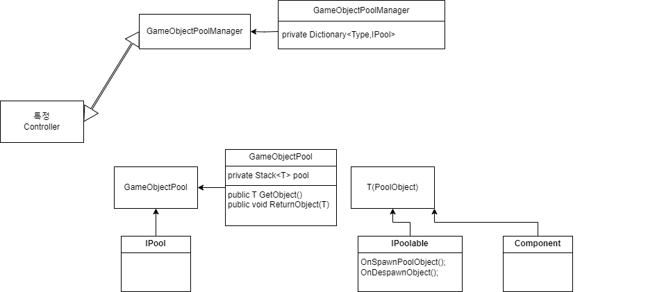

유니티에서 기본적으로 사용하는 Generic 코드 정리용

# **UIManager**
 UIManager 는 UIBaseController를 통해 UI를 관리

 Canvas 및 RayCaster 를 Cashing하여 렌더링 부하를 감소하여 최적화

 Enable을 껏다 켰다 할 때마다 SetDirty함수를 최소화 하여 관리하기 위해 제작

[UIManager 기능]
 - 특정폴더 (Resources/Prefabs/UI)에 UI 제작 후 동적으로 로딩 //Todo : 로딩할 때 Addressable 로 등록해서 동적으로 UI가 변경될 수 있도록 수정
  - HideAll // Showed 된 Panel을 모두 Hide 
  - Show
   - 캐시된 Panel이 존재한다면 Show 후 Controller Return
   - 캐시된 Panel이 없다면 특정폴더에서 Load하여 생성
  - SceneUnload 시 Stack,Dictionary 초기화

 [UIBaseController 기능]
  - Show
  - Hide
  - SetSortingOrder
  - NotchArea // Todo: 추후 모바일에서 Notch영역을 적용하기 위해 기능 추가 제작

# **GameObjectPool**
GameObjectPool 의 경우 Unity에서 Instantiate 및 Destroy 함수를 피하기 위해 제작

Enable 및 Disable를 활용하여 최적화

[GameObjectPoolManager 기능]
  - GetPool
  - SceneUnload 시 Pool 초기화

 [GameObjectPool 기능]
  - GetObject
  - ReturnObject

 [IPoolAble 기능]
  - OnSpawnObject 
  - OnDespawnObject

# **NetWorkManager**
 NetWorkManager 는 RestAPI를 사용하기 위해 제작 //Todo: 서버에 맞게 수정
 
 NetWorkManager의 경우 Partical 키워드를 통해 나눠서 제작

 Task가 아닌 UniTask를 사용하여 최적화
 