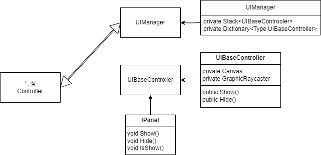

유니티에서 모바일 Generic Code 

[UIManager]
 UIManager 는 UIBaseController를 통해 UI를 관리
 Canvas 및 RayCaster 를 Cashing하여 렌더링 부하를 감소하여 최적화
 Enable을 껏다 켰다 할 때마다 SetDirty함수를 최소화 하여 관리하기 위해 제작

//사용법
 - 특정폴더 (Resources/Prefabs/UI)에 UI 제작

 UIManaber 기능
  - HideAll // Showed 된 Panel을 모두 Hide 
  - Show
   - 캐시된 Panel이 존재한다면 Show 후 Controller Return
   - 캐시된 Panel이 없다면 특정폴더에서 Load하여 생성
  - SceneUnload 시 Stack,Dictionary 초기화

 UIBaseController 기능
  - Show
  - Hide
  - SetSortingOrder
  - NotchArea // Todo: 추후 모바일에서 Notch영역을 적용하기 위해 기능 추가 제작
